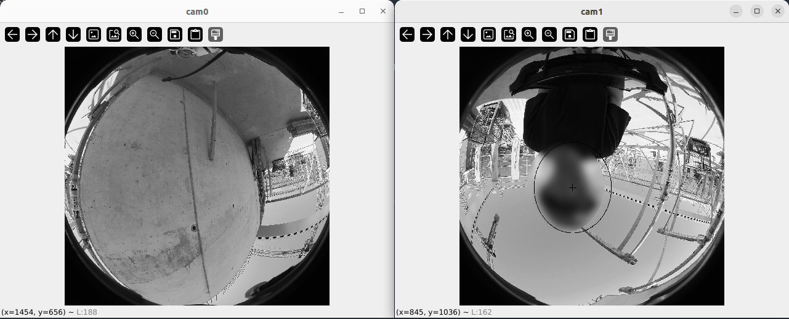

# rosbag_blur_face_tool

Tool to manually blur faces in rosbag images. The user draws an ellipse on each image and can use shortcuts to move forward and back in the rosbag. We used it to carry out privacy blurring of the [Oxford Spires Dataset](https://dynamic.robots.ox.ac.uk/datasets/).

The input is a rosbag. The output is a rosbag with the blurred images. The ellipses ("blur regions") can be written to a text file to allow the blurring to be refined later, if needed.

This tool currently works for ROS1 bag files.




## Description
- Opens bag files and displays three separate windows for cam0, cam1, and cam2.
- Allows click-and-drag to create blur regions, which can be further stamped with left-click.
- **S key**: Stamps the current blur region and advances by 1 frame.
- **Z, A, D, C keys**: Navigate backward and forward by 10 or 1 frames.
- Regions can be saved and loaded from a `.txt` file.
- **Erase blur regions**: Press X, middle-click, or right-click.
- **E key**: Exports blurred images and additional topics (IMU and LiDAR) to a new bag file.

## Dependencies
- `opencv-python`
- `rosbags` ([https://pypi.org/project/rosbags/](https://pypi.org/project/rosbags/))

## Key Bindings
- **1-0**: Quick warp to 10%-100% of frames.
- **O**: Warp to the 0% frame position.
- **Q**: Quit.
- **W**: Write blur regions to `.txt`.
- **R**: Read blur regions from `.txt`.
- **E**: Exports blurred images and additional topics (IMU and LiDAR) to a new bag file.
- **A / D**: Move back or forward by 1 frame.
- **Z / C**: Move back or forward by 10 frames.
- **S**: Stamp previous blur region and advance by 1 frame.
- **Left Click**: Stamp previous blur region.
- **Left Click + Drag + Release**: Create and stamp a new blur region.
- **X / Middle Click / Right Click**: Remove blur region.
- **F / V**: Increase or decrease stamp size.
- **B**: Toggle display between blurred region and blur border outline.

## Configuration and Usage

First configure a `main.py` file - using the examples in this directory to have the correct list of `camera_topics` and `passthrough_topics`.

Then you can run the module as follows - configured for your specific device:

```
python main_frontier_v7.py /path-to-your/ros1bag.bag
python main_insta360.py /path-to-your/ros1bag.bag
````

## Author 

Jiahao Wang, Oxford Robotics Institute
